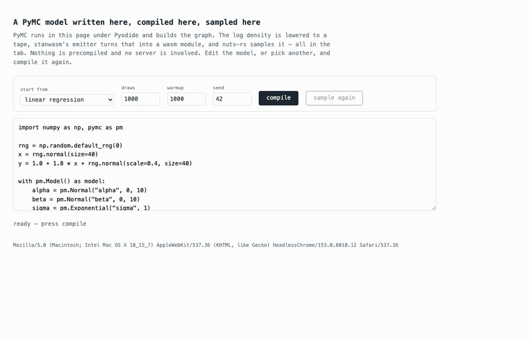

# pymcwasm

Sample a PyMC model in a browser. The log density is compiled to a WebAssembly
module and drawn from by [nuts-rs](https://github.com/pymc-devs/nuts-rs); no
server does the sampling.

**[habakan.github.io/pymcwasm](https://habakan.github.io/pymcwasm/)** — both
ways in, running.



*Editing a PyMC model in the page, compiling it, and drawing from it. The second
sample is milliseconds because the compiling is already done. Recorded with
`scripts/record-demo.mjs`; the Pyodide and PyMC load that precedes it is cut.*

There are two ways in. They are different trades, not a real one and a
shortcut, and the engine underneath is the same either way.

| | **in the page** | **compiled beforehand** |
| --- | --- | --- |
| the model is written | in Python, in the page | in Python, on your machine |
| the browser loads | Pyodide, PyMC, and a sampler | one module and a sampler |
| that costs | tens of megabytes, tens of seconds | tens of kilobytes |
| model and data | anything, changed and recompiled live | fixed when the page was built |
| suits | a notebook, a teaching page where the reader edits the model | a post or a document with one model in it |
| here | `examples/pyodide/` | `examples/browser/` |

The engine underneath is [tapewasm](https://github.com/habakan/tapewasm): it
takes an autodiff tape, emits it as a wasm module, and samples that module with
nuts-rs. It knows nothing about PyMC, or about any other way of writing a
model.

The same two shapes exist for Stan against that same engine — a sibling front
end onto it, not a step in this one:
[stanwasm](https://github.com/habakan/stanwasm)'s gallery compiles Stan source
in the page from JavaScript, and
[pystanwasm](https://github.com/habakan/pystanwasm) drives it from Python under
Pyodide. What this repository adds is a PyMC front end.

## Write the model in the page

PyMC runs under Pyodide, builds the graph, and everything after that happens in
the page too: the log density is lowered to a tape, tapewasm's emitter turns
that into a wasm module, and nuts-rs samples it. The model and its data are
whatever you typed.

```python
import pymcwasm

fit = await pymcwasm.sample(model, draws=1000, warmup=1000, seed=42)
fit["beta"]      # one parameter's draws
fit.summary()    # mean and sd per parameter
```

```
npm install
npm start        # then open /examples/pyodide/
```

Costs a Pyodide runtime and a PyMC install on first load — tens of megabytes,
tens of seconds. Compiling a small model then takes about a second, and drawing
1000 times takes about ten milliseconds.

## Compile it beforehand and ship the module

Nothing Python-shaped reaches the browser. A build step turns a model into a
5–35 KB wasm module, and the page loads that and a sampler.

```
npm start        # then open /
npm test         # the same seven models in three engines, checked against nutpie
```

### What a build step produces

Compiling a model writes three files into `artifacts/<model>/`. Together they
are everything a page needs; there is no other state.

| | |
| --- | --- |
| `model.wasm` | the module. Exports `log_prob_grad`, imports linear memory and its own arithmetic. |
| `meta.json` | the numbers that go with it — see below. |
| `reference.json` | nutpie's posterior for the same model, so the page can check itself, and the versions that produced it. Not needed to sample. |

`meta.json` holds four things the module cannot carry itself:

- **`nParams`** — how wide a draw is.
- **`scratchInit`** — the buffer the module works in. Two slots per tape node
  for values and derivatives, with the constants a re-rolled loop reads at the
  end. The host owns it; the module only writes into it.
- **`layoutId`** — a hash of the graph, the parameter count and those
  constants, exported from the module as well. A page binds one module at a
  time, and a buffer sized for one model handed to another would write at
  offsets it was never sized for, so the two ids are compared before the first
  call rather than after the draws come out wrong.
- **`paramNames`** and **`initialPoint`** — what the columns are called, and a
  starting point the sampler accepts.

Building one needs Python, PyMC and a tapewasm checkout — `build/README.md` —
which is why these are committed. Reading one needs nothing.

### What a page does with one, in full

```js
import init, { AotSampler, setAotExports, sharedMemory } from "tapewasm";

await init();
const meta = await (await fetch("/artifacts/eight_schools/meta.json")).json();
const bytes = await (await fetch("/artifacts/eight_schools/model.wasm")).arrayBuffer();

// The module imports its own arithmetic. `examples/browser/app.js` carries the
// series for lgamma, digamma and Phi; a model that reaches none of them can
// pass anything for those three.
const aot = await WebAssembly.instantiate(bytes, {
  tapewasm: { memory: sharedMemory() },
  Math: { exp: Math.exp, log: Math.log, pow: Math.pow, sin: Math.sin, cos: Math.cos,
          tan: Math.tan, asin: Math.asin, acos: Math.acos, atan: Math.atan,
          lgamma, digamma, phi },
});
setAotExports(aot.instance.exports);

const sampler = new AotSampler(
  meta.nParams, new Float64Array(meta.scratchInit), meta.layoutId, meta.paramNames,
);
const flat = sampler.sample(new Float64Array(meta.initialPoint), 1000, 1000, 42n);
```

`flat` is draws-major and `meta.nParams` wide, warmup first. `meta` is what the
build step recorded beside the module; `setAotExports` binds one module per
page, and sampling with the wrong one bound is refused rather than mixed, by the
layout id both sides carry.

The module answers for exactly one model and one dataset — the data is compiled
in — so changing either means building again. For a page whose model was decided
when the page was written, that is the whole cost, and nothing has to load a
Python runtime to read it.

## Is it right?

Every model is checked twice.

**The gradient**, against `model.compile_dlogp()`, at a point other than the one
it was lowered at, so a subgraph wrongly frozen into a constant shows up instead
of cancelling. The worst of the seven is 1.8e-15 relative.

**The posterior**, against `nutpie.compile_pymc_model` on the same model, in the
unconstrained space so transformed parameters are checked rather than skipped.
The furthest any parameter's mean sits from nutpie's is 0.46 sd, on
eight_schools written centred — the funnel, where two samplers taking different
trajectories disagree by about that much. Everything else is under 0.15 sd.

That number moves with nutpie, not only with this code: nutpie 0.16.8 puts the
same model's `tau_log__` a third of its own sd from where an earlier version
put it, against the same seed. `reference.json` records the versions that
produced it so a moved number can be told from a broken one.

Both are run by hand — `python src/pymcwasm/lowering.py` and `npm test` — when
the emitter or the lowering moves, rather than on every commit. What they check
changes with those two and with nothing else here, and three browser engines is
a large install to pay for per push.

Not a speed claim, in either direction.

## How it works

`src/pymcwasm/lowering.py` walks the PyTensor graph of `model.logp()` and writes
it as instructions for the autodiff tape in
[tapewasm](https://github.com/habakan/tapewasm), whose emitter turns a tape into
a standalone wasm module and whose `AotSampler` runs nuts-rs against one.

PyMC does not need the autodiff — PyTensor differentiates its own graph, and the
tape here carries a log density that is already differentiable, not a
translation of the model. What the tape buys is a form the emitter can turn into
wasm.

```
src/pymcwasm/      the package a Pyodide page imports, and the lowering
build/             turns a model into an artifact (needs a tapewasm checkout)
artifacts/         seven of them, committed
examples/browser/  the precompiled path
examples/pyodide/  the in-page path
```

## What it cannot do

- **`Scan` is not lowered**, so state-space models are out. It did not appear in
  any of the nine logp graphs surveyed, but it will.
- **A `Switch` on a parameter is refused** rather than resolved while tracing,
  which rules out truncated and censored likelihoods.
- **A Gaussian process is untried.** Its `Cholesky` is of a covariance built from
  the parameters, so it lowers to a cubic number of tape nodes in the number of
  points. Nothing is known to be wrong with it.
- **The starting point has to be searched for.** nuts-rs refuses a start whose
  gradient has a zero component, and PyMC's `initial_point()` is zeros — at which
  a centred hierarchical model has an exactly zero gradient in its population
  mean, and so does a logit regression on balanced data. `pymcwasm.sample` looks
  for one; a caller supplying its own has to as well.
- **Continuous parameters only**, and no prior or posterior predictive.
  `Fit.to_inference_data()` gives ArviZ the posterior and, with a tapewasm
  that returns them, the sampler statistics — no `log_likelihood` group yet.

## Status

An experiment. It answers whether the thing runs, not whether it should exist.
Not affiliated with PyMC.

Licensed under either of [Apache-2.0](LICENSE-APACHE) or [MIT](LICENSE-MIT),
at your option. Unless you state otherwise, any contribution you submit shall be
dual licensed as above, with no additional terms.
