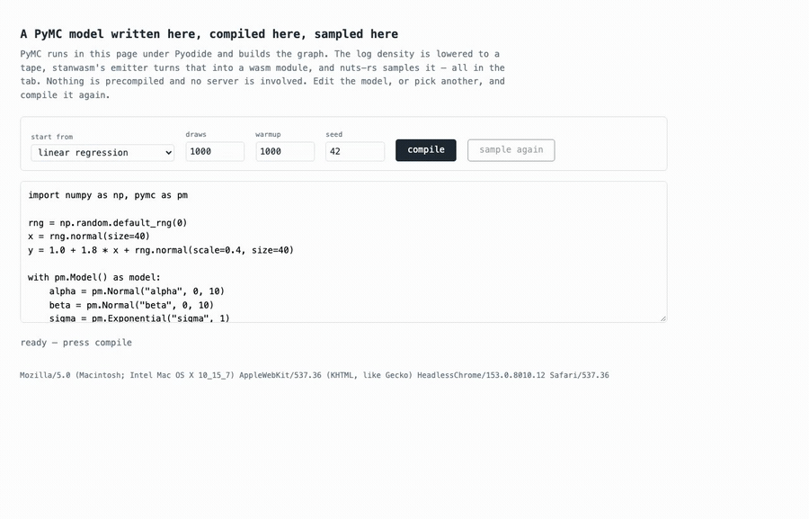

# pymcwasm

Sample a PyMC model in a browser. The log density is compiled to a WebAssembly
module and drawn from by [nuts-rs](https://github.com/pymc-devs/nuts-rs); no
server does the sampling.

**[habakan.github.io/pymcwasm](https://habakan.github.io/pymcwasm/)** — both
ways in, running.



*Editing a PyMC model in the page, compiling it, and drawing from it. The second
sample is milliseconds because the compiling is already done. Recorded with
`scripts/record-demo.mjs`; the Pyodide and PyMC load that precedes it is cut.*

There are two ways in. They are different trades, not a real one and a
shortcut, and the engine underneath is the same either way.

| | **in the page** | **compiled beforehand** |
| --- | --- | --- |
| the model is written | in Python, in the page | in Python, on your machine |
| the browser loads | Pyodide, PyMC, and a sampler | one module and a sampler |
| that costs | tens of megabytes, tens of seconds | tens of kilobytes |
| model and data | anything, changed and recompiled live | fixed when the page was built |
| suits | a notebook, a teaching page where the reader edits the model | a post or a document with one model in it |
| here | `examples/pyodide/` | `examples/browser/` |

The engine underneath is [tapewasm](https://github.com/habakan/tapewasm): it
takes an autodiff tape, emits it as a wasm module, and samples that module with
nuts-rs. It knows nothing about PyMC, or about any other way of writing a
model.

The same two shapes exist for Stan against that same engine — a sibling front
end onto it, not a step in this one:
[stanwasm](https://github.com/habakan/stanwasm)'s gallery compiles Stan source
in the page from JavaScript, and
[pystanwasm](https://github.com/habakan/pystanwasm) drives it from Python under
Pyodide. What this repository adds is a PyMC front end.

## Write the model in the page

PyMC runs under Pyodide, builds the graph, and everything after that happens in
the page too: the log density is lowered to a tape, tapewasm's emitter turns
that into a wasm module, and nuts-rs samples it. The model and its data are
whatever you typed.

```python
import pymcwasm

fit = await pymcwasm.sample(model, draws=1000, warmup=1000, seed=42)
fit["beta"]      # one parameter's draws
fit.summary()    # mean and sd per parameter
```

`reroll="never"` emits the straight-line module, which V8 runs about twice as fast on
a large model, and `target_accept`, `grad_based_estimate` and `max_depth` go to the
sampler as nutpie's options do.

```
npm install
npm start        # then open /examples/pyodide/
```

Costs a Pyodide runtime and a PyMC install on first load — tens of megabytes,
tens of seconds. Compiling a small model then takes about a second, and drawing
1000 times takes about ten milliseconds.

The diagnostics on that page are ArviZ's own — `az.summary` and three
`arviz_plots` figures — and PSIS-LOO beside them. The fit carries its own
log-likelihood: each observation's term is named in the module, and one forward
pass per draw reports it, so `az.loo` has what it needs without PyMC
recomputing anything (an older tapewasm cannot report them, and
`pm.compute_log_likelihood` fills in as before). The table reports `elpd_loo` with
its standard error, `p_loo`, and the Pareto k diagnostic; observations past the
threshold ArviZ warns at are flagged, since that is the one number saying the
estimate itself is unreliable. A model with nothing observed says so and the
other diagnostics carry on.

### Or fit it by variational inference

The same module also runs tapewasm's mean-field ADVI, for models NUTS is slow on
in a page:

```python
approx = await pymcwasm.fit(model, n=10000)   # or compiled.fit(...)
approx.mean, approx.std   # per unconstrained scalar, named in approx.names
approx.hist               # the loss, the negative ELBO, per iteration, as PyMC's
idata = approx.sample(1000)
```

On the seven models here, with the same optimizer (Adam at 0.01) and 40,000
iterations, its means sit closer to PyMC's own ADVI than PyMC's three seeds sit to
each other, and within 0.06 posterior sd of nutpie's except on eight schools, where
mean-field ADVI is known to shrink `tau` (PyMC's lands 0.84 sd off too).
`scripts/advi_compare.py` runs that comparison. At the default 10,000 iterations
`matrix_regression` and `lkj_mvnormal` have not converged yet, as with PyMC's
default, so read `hist` before trusting a fit. Full-rank ADVI is not available.

The network in `examples/live-decoder/` — 4,344 parameters — written as a PyMC
model compiles in 3.3 s under Pyodide and fits in 13 s to the same reconstruction
error as the hand-written tape there (`examples/pyodide/advi-check.mjs`).

## Compile it beforehand and ship the module

Nothing Python-shaped reaches the browser. A build step turns a model into a
5–35 KB wasm module, and the page loads that and a sampler.

The page samples four chains, and its ArviZ button diagnoses them with
[posteriorwasm](https://github.com/habakan/posteriorwasm): arviz-stats on
Pyodide in a worker, about 24 MB fetched only when pressed. PSIS-LOO comes with
them, off the module's own pointwise log-likelihood — the one group a page with
no Python could not produce before.

```
npm start        # then open /
npm test         # the same seven models in three engines, checked against nutpie
```

### What a build step produces

Compiling a model writes these files into `artifacts/<model>/`. Together they
are everything a page needs; there is no other state.

| | |
| --- | --- |
| `model.wasm` | the module. Exports `log_prob_grad`, imports linear memory and its own arithmetic. |
| `expand.wasm` | a second module whose `evaluate` maps one draw to each free variable in its own space and each deterministic, raveled in the order nutpie and nuts-rs-wasm's Numba path call the expansion. `--no-expand` leaves it out. |
| `meta.json` | the numbers that go with it — see below. |
| `reference.json` | nutpie's posterior for the same model, so the page can check itself: a mean, an sd and that mean's `mcse` per parameter, and the versions that produced them. Not needed to sample. |

`meta.json` holds four things the module cannot carry itself:

- **`nParams`** — how wide a draw is.
- **`scratchInit`** — the buffer the module works in. Two slots per tape node
  for values and derivatives, with the constants a re-rolled loop reads at the
  end. The host owns it; the module only writes into it.
- **`layoutId`** — a hash of the graph, the parameter count and those
  constants, exported from the module as well. A page binds one module at a
  time, and a buffer sized for one model handed to another would write at
  offsets it was never sized for, so the two ids are compared before the first
  call rather than after the draws come out wrong.
- **`paramNames`** and **`initialPoint`** — what the columns are called, and a
  starting point the sampler accepts.

Beside them, `expand` carries `expand.wasm`'s own `scratchInit`, `layoutId` and
`nOutputs`, and its `layout` and `coords` in nuts-rs-wasm's `expanded_layout` form:
`{name, shape, size, dims}` per variable. On nuts-rs-wasm's demo MMM both match
what its Numba path reports, the 1,985 values agree with PyMC to 1e-15 at points
away from the trace point, and one draw's `evaluate` takes 26 µs in V8.
The MMM's expansion needs tapewasm 0.3.4, which records a sum over repeated rows.

Building one needs Python, PyMC and Node, and no Rust: the emitter is npm's
`tapewasm`, resolved from the working directory. A model file defines `model`,
or `make_model(data)` as posteriordb's do:

```
npm install tapewasm
pip install ".[build]"
pymcwasm-build model.py out/ --data data.json   # out/model.wasm, out/expand.wasm, out/meta.json
```

`--reroll always` trades gradient speed for a smaller module, and `--no-log-lik`
leaves out the per-observation terms. Reading an artifact needs nothing.

`examples/live-decoder/` is one built this way that is not sampled but fitted: a
4,344-parameter decoder of MNIST digits written in PyMC (`model.py`), built to a
308 KB module, and loaded and trained in the page by tapewasm's mean-field ADVI in 14–22 s
(`node examples/live-decoder/check.mjs`, Chromium, Firefox and WebKit).

### What a page does with one, in full

```js
import init, { AotSampler, setAotExports, sharedMemory } from "tapewasm";

await init();
const meta = await (await fetch("/artifacts/eight_schools/meta.json")).json();
const bytes = await (await fetch("/artifacts/eight_schools/model.wasm")).arrayBuffer();

// The module imports its own arithmetic. `examples/browser/app.js` carries the
// series for lgamma, digamma and Phi; a model that reaches none of them can
// pass anything for those three.
const aot = await WebAssembly.instantiate(bytes, {
  tapewasm: { memory: sharedMemory() },
  Math: { exp: Math.exp, log: Math.log, pow: Math.pow, sin: Math.sin, cos: Math.cos,
          tan: Math.tan, asin: Math.asin, acos: Math.acos, atan: Math.atan,
          lgamma, digamma, phi },
});
setAotExports(aot.instance.exports);

const sampler = new AotSampler(
  meta.nParams, new Float64Array(meta.scratchInit), meta.layoutId, meta.paramNames,
);
const flat = sampler.sample(new Float64Array(meta.initialPoint), 1000, 1000, 42n);
```

`flat` is draws-major and `meta.nParams` wide, warmup first. `meta` is what the
build step recorded beside the module; `setAotExports` binds one module per
page, and sampling with the wrong one bound is refused rather than mixed, by the
layout id both sides carry.

The module answers for exactly one model and one dataset — the data is compiled
in — so changing either means building again. For a page whose model was decided
when the page was written, that is the whole cost, and nothing has to load a
Python runtime to read it.

## Is it right?

Every model is checked twice.

**The gradient**, against `model.compile_dlogp()`, at a point other than the one
it was lowered at, so a subgraph wrongly frozen into a constant shows up instead
of cancelling. The worst of the seven is 1.8e-15 relative.

**The posterior**, against `nutpie.compile_pymc_model` on the same model, in the
unconstrained space so transformed parameters are checked rather than skipped.
The furthest any parameter's mean sits from nutpie's is 0.28 sd, on
eight_schools written centred — the funnel, where two samplers taking different
trajectories disagree by about that much, and where a page is allowed 0.5 sd
rather than the 0.3 the other six are held to. Everything else is under 0.04 sd.

The reference is 20,000 draws over 4 chains, and records its own `mcse` beside
each mean: at 1,000 draws it carried an error comparable to the gap it was
checking, and eight_schools' stored `mu` sat a third of an sd from its own
long-run value. It also records the versions that produced it, since the number
moves with nutpie and not only with this code.

**Beyond these seven**, `scripts/posteriordb.py` lowers every
[posteriordb](https://github.com/stan-dev/posteriordb) posterior with a PyMC
implementation, emits it with npm's tapewasm as `pymcwasm-build` does, and checks its
density, gradient and log-likelihood terms against PyMC's. With tapewasm 0.3.4, 79 of
83 agree to 1e-8 or better, all 35 that have a reference posterior among them; the
other four are refused (`AllocEmpty`, `BetaInc`, `Maximum`, a discrete parameter). On
`irt_2pl` and `lsat` PyMC's own gradient is NaN in some terms where its density is
finite, and those terms are checked against a central difference of the density instead.
38 of the 79 — radon, kidiq and others whose data repeats rows — are refused by 0.3.3.

`pytest tests` runs on every push. The posteriordb check runs in CI when the lowering or
the emitter moves, and weekly, and fails if a posterior in
`scripts/posteriordb-passing.txt` stops agreeing. `npm test` is run by hand: three
browser engines is a large install to pay for per push.

## How fast

`bench/` runs nine posteriordb posteriors, from 2 to 3,075 parameters, under five
samplers, and scores each by the smallest bulk ESS per second of sampling:
[`bench/RESULTS.md`](bench/RESULTS.md), on an Apple M3 with PyMC 6.3.2. What it shows:

- **Under Pyodide, `mode="WASM"` is 10–100x the Python linker** PyTensor otherwise
  falls back to there: 98 against 1 ESS/s on a 3,020-observation logistic regression.
- **`pymcwasm.sample` in the page matches PyMC's own NUTS on CPython** up to about a
  hundred parameters (eight schools 3,944 against 2,213 ESS/s, radon 89 parameters 345
  against 326), and trails nutpie on CPython by 3–10x.
- **It falls behind as the data grows.** On radon with 12,573 observations and on
  diamonds, nutpie is 3–15x faster: the module is a tape of scalars, where nutpie
  runs numba's vectorised loops.
- **nuts-rs mixes where PyMC's NUTS does not.** On `irt_2pl` PyMC's NUTS reaches 3
  effective draws, on CPython too, and its means sit 43 sd from nutpie's;
  `pymcwasm.sample` reaches 93 and agrees with nutpie to 0.14 sd.

One run each, 2 chains of 500 warmup and 500 draws; the horseshoe regression is not
settled at that length under any sampler, and `RESULTS.md` marks such rows.

## As a PyTensor backend

`import pymcwasm.linker` registers `mode="WASM"`: any `pytensor.function` is traced
at its first inputs, emitted by npm's tapewasm and run under `wasmtime`.

```python
import pymcwasm.linker
f = pytensor.function([x], pt.exp(x).sum(), mode="WASM")
model.compile_dlogp(mode="WASM")(point)     # PyTensor's own gradient graph, forward
```

Under Pyodide — JupyterLite, marimo — PyTensor has no C compiler and falls back to
its Python linker. There the page's tapewasm emits the module and the browser runs
it, after one `await pymcwasm.linker.load()`; PyMC's own NUTS then samples 3.8–6.7x
faster on three of the models here (`npm run test:linker-pyodide`, Chromium, a
worker, 300 draws). `examples/jupyterlite/` is the same in a real JupyterLite
notebook — PyMC 6.3, Python 3.14 — built by `examples/jupyterlite/build.sh` and run
cell by cell by `node examples/jupyterlite/check.mjs`. On eight schools, 2 chains of
1,000: PyMC's NUTS takes 5.8 s on the Python linker and 1.2 s with `mode="WASM"`;
`pymcwasm.sample`, with nuts-rs in the module as well, compiles in 0.21 s and draws in
0.02 s. Timing PyMC's NUTS under Pyodide, the module is about a tenth of the time
and PyMC's own Python the rest, which is what drawing inside the module removes. `examples/marimo/`
is marimo's Simpson's paradox notebook with `mode="WASM"` added to its three
`pm.sample` calls, exported by `marimo export html-wasm` and run by
`node examples/marimo/check.mjs`: 2, 6 and 23 s in the page against 8, 27 and 158 s on
the Python linker.

The tape has no branch, so a comparison on an input is taken the way it was traced;
its operands come back beside the outputs, and a call that goes the other way traces
again. Input shapes are fixed per trace the same way, and an integer input, such as a
group index, is folded in as a constant and traces again when its values change. `tests/test_linker.py` holds it to PyTensor's own backend, graph by
graph and on the seven models' logp and gradient.

## How it works

`src/pymcwasm/lowering.py` walks the PyTensor graph of `model.logp()` and writes
it as instructions for the autodiff tape in
[tapewasm](https://github.com/habakan/tapewasm), whose emitter turns a tape into
a standalone wasm module and whose `AotSampler` runs nuts-rs against one.

PyMC does not need the autodiff — PyTensor differentiates its own graph, and the
tape here carries a log density that is already differentiable, not a
translation of the model. What the tape buys is a form the emitter can turn into
wasm.

```
src/pymcwasm/      the package a Pyodide page imports, and the lowering
build/             the seven artifacts' build, with nutpie's reference beside each
artifacts/         seven of them, committed
examples/browser/  the precompiled path
examples/pyodide/  the in-page path
```

## What it cannot do

- **A `Scan` is unrolled**, so its step count is fixed when the model is compiled
  and the module grows with it. A `while` loop, and a `Scan` over another's
  gradient, are refused.
- **A `Switch` on an ordering of parameters needs tapewasm 0.3.5**, whose `pick`
  takes the branch where the module is evaluated rather than where it was traced;
  0.3.3 refuses the tape. A bounds check (one side an infinity) and a test for
  equality, which a parameter meets on a set of measure zero, still fold, and so does
  a bound that is a parameter on observed data (`Uniform("y", a, a + 3, observed=...)`),
  which is wrong away from the trace point. A condition that orders parameters and then
  goes through a reduction such as `all` is refused rather than folded. The gradient
  through a `pick` is right where the branch not taken has finite partials; PyTensor's
  switch rewrites also cover infinite ones.
- **Discrete parameters are refused by name**: NUTS samples continuous ones only.
- **A Gaussian process is untried.** Its `Cholesky` is of a covariance built from
  the parameters, so it lowers to a cubic number of tape nodes in the number of
  points. Nothing is known to be wrong with it.
- **The starting point has to be searched for.** nuts-rs refuses a start whose
  gradient has a zero component, and PyMC's `initial_point()` is zeros — at which
  a centred hierarchical model has an exactly zero gradient in its population
  mean, and so does a logit regression on balanced data. `pymcwasm.sample` looks
  for one; a caller supplying its own has to as well.
- **Continuous parameters only**, and no prior or posterior predictive.
  `Fit.to_inference_data()` gives ArviZ the posterior, the sampler statistics
  when tapewasm returns them, and a `log_likelihood` group when the module was
  compiled with the terms — `compile(model, log_lik=False)` leaves them out.
  Naming them costs a second forward pass in the module: 1.35–1.43x its bytes
  on five of the seven models here, and 2.35–2.65x on `matrix_regression` and
  `lkj_mvnormal`, where the density contracts and the per-observation terms are
  their own nodes rather than the density's.

## Status

An experiment. It answers whether the thing runs, not whether it should exist.
Not affiliated with PyMC.

Licensed under either of [Apache-2.0](LICENSE-APACHE) or [MIT](LICENSE-MIT),
at your option. Unless you state otherwise, any contribution you submit shall be
dual licensed as above, with no additional terms.
